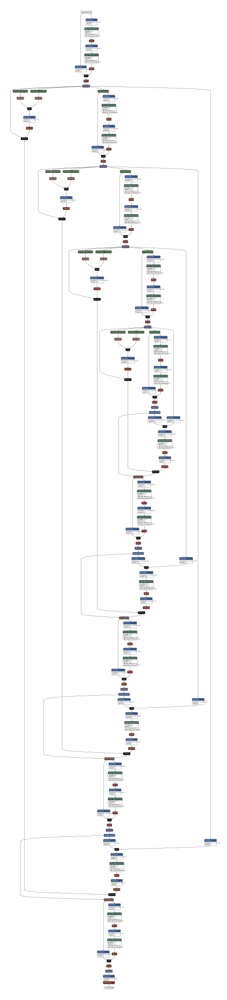

# Res-SANet

Res-SANet is a deep learning model for image segmentation, enhancing the SANet architecture with residual connections, batch normalization, feature pyramid networks, and dual-attention mechanisms.

## Features

- **Encoder-Decoder Structure**: Efficient feature extraction and reconstruction.
- **Residual Connections**: Prevent gradient vanishing.
- **Dual-Attention Mechanism**: Channel and spatial attention for refined feature localization.
- **Feature Pyramid Network**: Multiscale representation learning.

### MRI Images and Tumor Regions

### Model Pipeline and Architecture

### Model Diagram

### Testing Methodology and Flowchart

